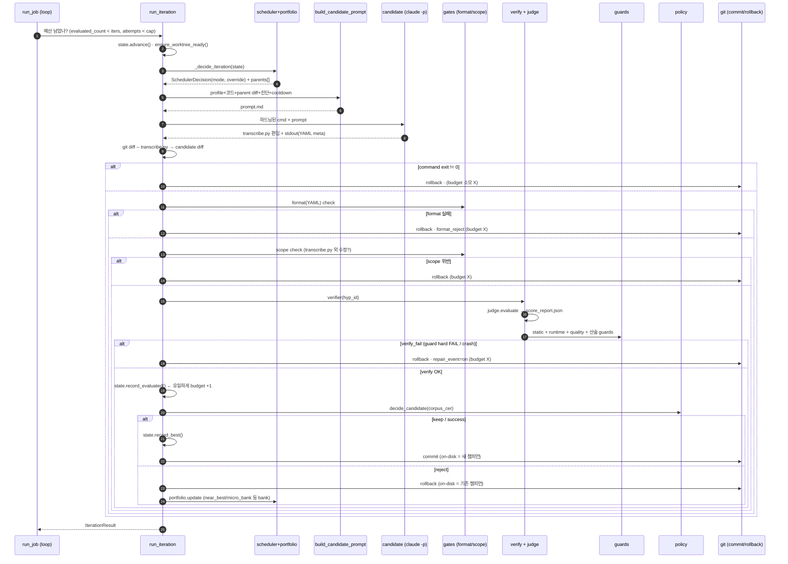
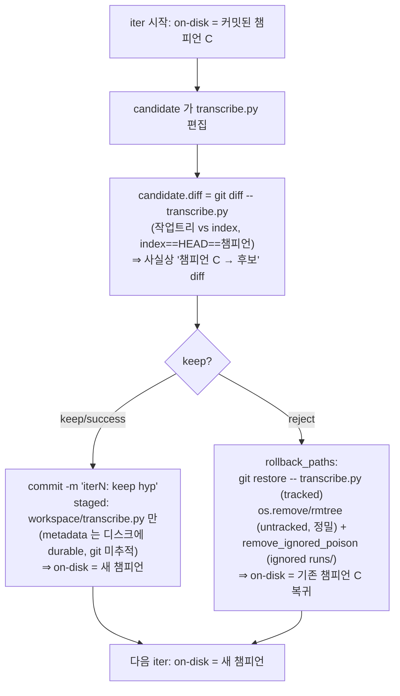
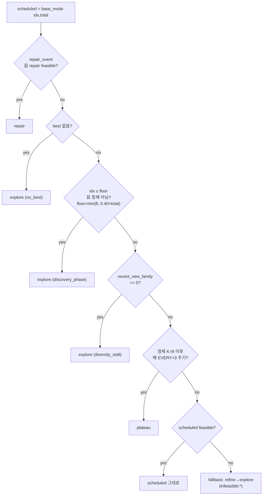
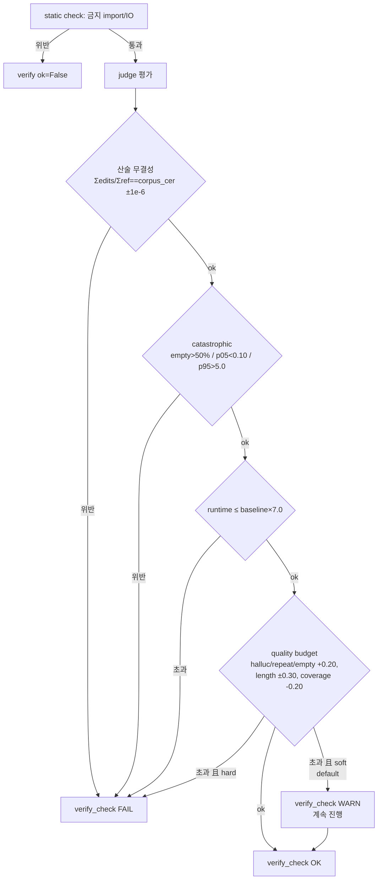
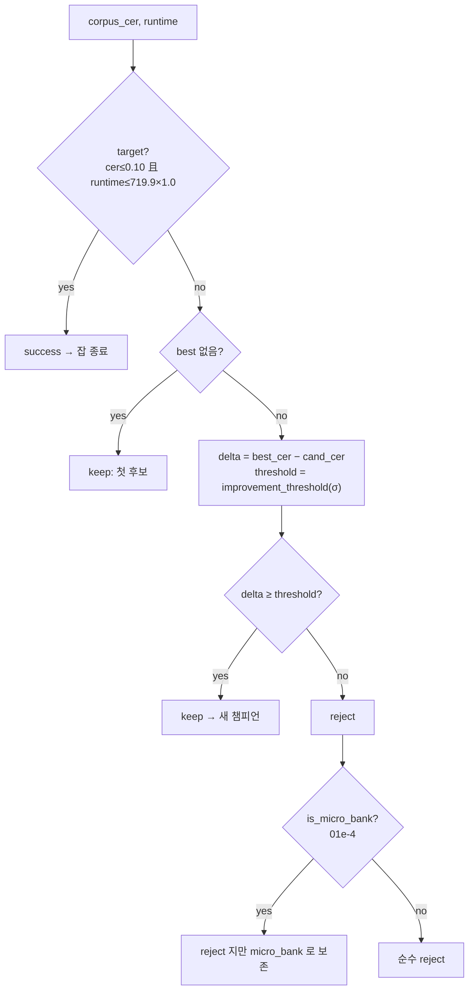

# HARNESS-MECHANICS — 코드 기준 동작 레퍼런스

> 목적: Phase 3 self-evolution harness 가 **실제 코드에서 어떻게 도는지**를 한 곳에
> 그림과 함께 정리한다. 운영 정본(SSOT §2)이 아니라 **코드 스냅샷 기반 학습/이해용
> 보조 문서**다. 정책을 바꿀 때는 SSOT §2 의 정본(PHASE3-PLAN 등)을 먼저 고친다.
>
> - 작성: 2026-06-04 (서브에이전트 3종 코드 매핑 종합)
> - 근거: `harness/runner.py`, `scheduler.py`, `portfolio.py`, `signature.py`,
>   `cooldown.py`, `policy.py`, `config.py`, `state.py`, `verify.py`, `guards.py`,
>   `judge/`, `baseline/target_cer.json`. 수치는 작성 시점 코드 값.
> - 충돌 시: **코드 > 이 문서**. 이 문서가 코드와 어긋나면 코드가 맞다.

---

## 0. 한눈에 — 멘탈 모델

이 harness 는 **단일 스칼라(`corpus_cer`) 위의 greedy hill-climbing(1+1)** 이다.
매 iteration:

1. **scheduler** 가 이번에 뭘 할지 **mode** 를 정한다(explore/refine/combine/ablate/
   repair/plateau).
2. **portfolio** 가 그 mode 에 맞는 **parent**(들)를 고른다.
3. **runner** 가 profile + 현재 코드 + parent diff + 진단 + cooldown 경고를 합쳐
   **prompt** 을 만들고 `claude -p` candidate 를 실행한다.
4. candidate 가 `workspace/transcribe.py` 를 편집한다.
5. **gate** 들(command exit → format → scope → verify)을 통과하면 **judge** 가 평가해
   `score_report.json` 을 낸다.
6. **guards** 가 안전성(런타임/품질/산술)을 검사한다.
7. **policy** 가 `corpus_cer` 로 **keep / reject** 를 결정한다.
8. **keep** 이면 디스크에 남기고 git commit, **reject** 면 git 으로 챔피언 상태로
   rollback. (단 reject 라도 portfolio 가 **parent 재료**로 일부를 bank 할 수 있다.)
9. **signature/family/cooldown** 이 이 시도를 기록해 다음 mode/parent 결정에 피드백.

핵심 불변식: **매 iter 끝나면 on-disk `workspace/transcribe.py` == 마지막으로 commit
된 챔피언.** 모든 mode 가 이 챔피언 위에서 편집을 시작한다.

핵심 수치(현재):
- `baseline_cer = 0.17144`, `target_cer = 0.10`, `macro_cer = 0.18582`
  (`AIG_녹취반출_20250715` 배치, 11파일, 문자가중)
- 챔피언(phase3_013) `corpus_cer = 0.1539`
- runtime baseline `total_inference_time_s = 719.9s`

---

## 1. 한 iteration 의 전체 흐름 (sequence)



**중요 포인트:**
- **budget(`evaluated_count`)은 verify 가 성공해 score 가 나온 iter 에서만 +1** 된다
  (`state.record_evaluated()`, runner.py 2081). command/format/scope/verify-fail reject 는
  예산을 **안 깎는다**. 그래서 `--iters 100` = "평가까지 간 후보 100개".
- attempt cap = `iters*3 + 10` (runner.py 2135) — reject 폭주 시 무한루프 방지.

---

## 2. iteration 파이프라인 — gate 와 budget

순서대로 통과해야 평가에 도달한다. 각 gate 의 reject 는 **rollback 하고 예산을 안 쓴다.**

| 단계 | 위치 | 무엇 | 실패 시 | budget |
|---|---|---|---|---|
| advance | runner 1827 | iteration+1, hyp_id 결정 | — | — |
| worktree ready | 331 | on-disk == 챔피언 확인 | RuntimeError(잡 중단) | — |
| decide | 1190 | mode + parent 결정 | — | — |
| prompt | 1314 | prompt.md 작성 | — | — |
| run candidate | 1446 | claude -p 실행, **candidate.diff 캡처** | command_fail | X |
| command exit | 1886 | returncode==0? | reject(연속 3회 → 잡 중단) | X |
| **format** | 1919 | stdout 마지막 ```yaml``` 블록 검증 | reject(초반 5iter 중 4회 → 중단) | X |
| **scope** | 1966 | transcribe.py 외 파일 수정? | reject | X |
| **verify** | 1995 | judge 평가 + guards | verify_fail → **repair_event** | X |
| post-verify scope | 2011 | verify 중 금지경로 기록? | reject | X |
| verify ok? | 2048 | score_report 존재? | reject | X |
| **record_evaluated** | 2081 | **여기서만 budget +1** | — | **+1** |
| **policy** | 2083 | keep/reject(아래 §8) | — | — |

format check 가 요구하는 YAML meta(candidate stdout 마지막 블록):
`capability_investigated`, `what_i_learned`, `hypothesis`, `fingerprint`(1~6개 토큰).

---

## 3. git 라이프사이클 — diff·commit·rollback·불변식

이 부분이 설계 결정의 핵심이라 따로 본다.



**불변식: on-disk `transcribe.py` == 마지막 commit(챔피언).**
- `ensure_worktree_ready`(331) 가 iter 시작 시 이를 강제 — 더러우면 잡 중단.
- reject 의 `rollback_paths` 가 이를 유지 — `git restore`(tracked) + 정밀 파일 삭제
  (`os.remove`/`shutil.rmtree`, untracked). `git clean` 은 더 이상 쓰지 않는다(phase1.5).
- keep 의 `commit_iteration` 이 새 챔피언으로 갱신 — **`workspace/transcribe.py` 만** 스테이징.

**commit 정책 (phase1.5 — `runs/` off-git).** `runs/` 는 이제 전부 gitignore 된다.
run metadata(`state`/`portfolio`/`decisions`/`candidate_meta`/`HISTORY`)는 atomic
write(`HarnessState.save`/`Portfolio.save` 의 tmp + `os.replace`) 와 append(jsonl /
`HISTORY.md`)로 **디스크에 durable 하게** 남고, git commit 은 **code checkpoint 전용** —
code-advancing status(`keep`/`success`/`lineage_advance`/`reset`)에서만 `workspace/transcribe.py`
하나를 커밋한다(`reject`/`repair_rollback`/`abort` 는 no-op). 이로써 per-iter
metadata-commit churn 이 사라진다(HARNESS-REDESIGN §80). resume 은 디스크 파일만으로
충분하다(`load_or_init_state`).

scope 위반 탐지는 두 surface 로 나뉜다. **tracked surface**(`baseline/`, `docs/`, 임의의
추적 경로) 에 대한 후보 쓰기는 종전 그대로 `git status --porcelain --untracked-files=all`
로 잡힌다(`--ignored` 는 붙이지 **않는다** — 붙이면 `runs/` 아래 기존 ignored 파일이 전부
나열돼 매 iter false-reject 가 된다). **ignored `runs/` surface** — 후보가
`runs/_summary/`(metadata poison) 나 엉뚱한 top-level `runs/<dir>` 에 쓰는 것 — 은 git
이 더 이상 못 보므로, iter 마다 그 두 surface 만 떠서 비교하는 pre/post 파일시스템
스냅샷 diff(`snapshot_ignored_surface`/`diff_ignored_surface`)로 탐지한다. 위반 시
rollback 은 어긋난 경로만 정밀하게 파일시스템에서 지운다(`os.remove`/`shutil.rmtree`,
ignored 쪽은 `remove_ignored_poison`) — **절대 `git clean` 을 쓰지 않는다** (무관한
untracked 파일을 함께 지우던 실제 사고를 제거).

**`candidate.diff` 의 base 는 항상 HEAD(=챔피언).** (runner.py 1472:
`git diff -- workspace/transcribe.py`. index 는 항상 깨끗하므로 HEAD 기준과 동일.)
→ 이 diff 가 signature/family/cooldown 의 입력이다(§5). **후보가 파일을 통째로 새로
쓰면 diff 는 "챔피언 전체 삭제 + 새 구조 추가" 가 된다** — 이게 explore 비앵커 설계의
제약(아래 §10).

**resume 안전성:** 상태는 전부 `runs/_summary/<job>_state.json` 에 직렬화. 재시작 시
on-disk 는 이미 마지막 챔피언이고, `evaluated_count`/`iteration` 은 JSON 에서 복원.
mode 스케줄은 `evaluated_index` 의 순수함수(§4)라 재현됨.

---

## 4. mode 결정 — base schedule + override

### 4.1 6개 mode

| mode | 목적 | feasible 조건 |
|---|---|---|
| explore | 새 메커니즘 발견(greenfield) | 항상 |
| refine | parent 1개를 튜닝 | parent ≥ 1 |
| combine | 다른 family parent 2개 접목 | distinct family ≥ 2 |
| ablate | global_best 에서 복잡도 제거 | global_best 존재 |
| repair | 직전 실패 수습 | best 있음 OR repair_event |
| plateau | 정체 시 주기적 재조합(combine 류) | 항상 |

### 4.2 base schedule (`base_mode`, 순수함수)

`base_mode(evaluated_index, total)` 은 RNG 없는 **error-diffusion 누적기**. 구간별 가중치
(scheduler.py 32–36):

| 구간(progress) | explore | refine | combine | ablate |
|---|---|---|---|---|
| 0–40% | 0.75 | 0.25 | 0 | 0 |
| 40–75% | 0.50 | 0.25 | 0.13 | 0.12 |
| 75%+ | 0.40 | 0.28 | 0.20 | 0.12 |

→ 초반 explore-heavy, 후반 exploit 혼합. **결과와 무관(outcome-independent)** 하므로
resume 해도 같은 mode 열이 재현된다.

> 참고: `config.py` 의 `EXPLORE_RATIO_START/FLOOR/DECAY`(0.9/0.3/18)와 `_explore_ratio`/
> `_is_explore_iter`/`_iteration_mode` 는 scheduler 이전의 **구(舊) 2-mode 경로**다. 현재
> 운영 스케줄은 위 `base_mode` + override 다(아래). 혼동 주의.

### 4.3 override precedence (`decide_mode`, 첫 매칭 우선)



상수: `DISCOVERY_FLOOR_FRAC=0.40`, `DISCOVERY_FLOOR_ABS_CAP=8`,
`floor = min(8, int(0.40×total))`; `PLATEAU_K=8`, `PLATEAU_EVERY=3`.

- **discovery_phase**: 초반 floor(최대 8 evaluated iter)는 best 가 있어도 explore 강제.
  단 이미 정체(iters_since_best ≥ 8)면 풀려서 plateau/exploit 가 끼어듦.
- **plateau 는 영구가 아니라 주기 burst** — K 넘은 뒤 EVERY=3 마다 한 번만.
- feasibility 는 portfolio 가 계산: refine=entry≥1, combine=family≥2, ablate=global_best.

> **관찰 예시(phase3_014):** iter1 explore(no_best) → crash → iter2 repair(repair_event)
> → iter3 explore(discovery_phase). scored 8회 전까진 explore 가 기본, refine/combine/
> ablate 는 floor 통과(evaluated_index > 8) 후 base schedule 에서 등장.

---

## 5. parent 선택 + family/signature + cooldown

### 5.1 portfolio bank (6종)

| bank | 무엇 | admission |
|---|---|---|
| global_best | 챔피언 hyp_id(스칼라) | keep/success 시 |
| family_best | family 별 최저 cer | family 내 cer 최저 |
| metric_best | 축(axis)별 최고 | 각 축 최소값 갱신 시 |
| near_best | 챔피언 근방 풀 | **cer ≤ global_best × 1.20** (cap 24, best 갱신 시 prune) |
| micro_bank | reject 지만 유망 | policy 가 micro_bank 판정(§8) |
| rejected_promising | 축 개선 reject(synthesis 재료) | 축 개선 reject |

`_NEAR_BEST_FACTOR=1.20`, `_NEAR_BEST_MAX=24` (portfolio.py 36/38). near_best 는
**champion-relative** 라 best 가 좋아지면 컷이 같이 좁아지고 풀이 prune 된다.

### 5.2 mode → parent (`parents_for_mode`)

| mode | parent | 선택 |
|---|---|---|
| refine | 1개 | ranked_pool 을 `evaluated_index % N` 로 회전 |
| ablate | global_best | 항상 챔피언 |
| combine | 2개 | family 별 최고 중 **cer 상위 2 family** 고정 |
| plateau | 2개 | family 회전쌍 `start=idx%N, next=(start+1)%N` |
| explore | 0 | greenfield(없음). 단 promising reject 를 synthesis 로 보조주입 |
| repair | 0→합성 | 직전 verify_fail iter 의 diff+stderr 로 합성 parent |

parent diff 는 prompt 의 "Parent candidate(s) to build on" 블록에 `family · cer · axes`
와 함께 injected(runner 1222). **단, 후보는 on-disk 챔피언을 편집하므로 parent 는
"이 diff 를 참고/적용하라"는 재료**다(베이스 코드는 여전히 챔피언).

### 5.3 family/signature (signature.py)

`candidate.diff` → `extract_features` → 토큰화 → `compute_signature`(정확반복 지문) +
`assign_family`(Jaccard 묶음).

- 토큰 namespace 7종: `region: api: param: stage:` (추가줄) + `rmapi: rmparam: rmstage:`
  (삭제줄, ablation false-merge 방지).
- family: 기존 family 대표 토큰과 **Jaccard ≥ 0.5** 면 같은 family, 아니면 새
  `family_NNN`. (보수적: false-split > false-merge.)
- 주석/문자열은 제거 후 추출(키워드 spoofing 차단).
- **lineage 상속**: refine/ablate/repair/combine/plateau 는 **첫 parent 의 family 를
  상속**. explore 만 signature 로 새 family.
- decisions.jsonl 에 `feature_tokens`/`harness_family_id` 를 저장해 resume 시 family 번호
  재구성(결정적).

### 5.4 cooldown (soft, 경고만)

decisions.jsonl 에서 **비개선(`reject` + `micro_bank`)** 을 집계:

| 키 | 임계 | 효과 |
|---|---|---|
| signature | ≥ 2 | "이 지문 그대로 재시도 말라" |
| family | ≥ 5 | "이 family 는 새 각도로" |
| API surface 토큰 | ≥ 3 | "이 backend 표면 그만 맴돌아라" |

prompt 에 **soft warning 으로만** 노출(verify 전 hard reject 안 함). MVP 단계 — 첫 run
오탐 확인 후 hard gate 검토. micro_bank 도 비개선에 포함하는 이유: align/rerank 류가
한 축만 개선해 micro_bank 로 빠지면 reject-only 카운트를 우회하던 정체를 막기 위함.

---

## 6. 평가 (judge/)

### 6.1 corpus_cer 와 score_report

- 배치 `AIG_녹취반출_20250715`: `data/raw/{wav,label}/...`, `*_l.txt`(좌채널)만, 빈 라벨
  제외, wav 정렬(결정적). 현재 11파일.
- 각 파일: librosa 16kHz mono 로딩 → `transcribe(audio, sr)` 호출(decode 시간 측정) →
  ref/hyp **normalize**(NFC, `[INAUDIBLE]` 제거, 구두점 제거, 소문자, 공백 제거) →
  Levenshtein(sub/del/ins).
- **`corpus_cer = Σedits / Σref_chars`** (문자가중). `macro_cer` 는 파일별 cer 평균(비가중).

`score_report.json` 주요 필드:
```
corpus_cer, macro_cer,
error_breakdown{sub_ratio, del_ratio, ins_ratio},
length_ratio{mean, p05, p95},
empty_output_rate, repeated_text_rate,
hallucination_hit_rate, hallucination_hits_total,
total_audio_s, total_inference_time_s, avg_rtf
```

### 6.2 축(AXES) — 다축 관점

portfolio.py 25–30, 모두 lower-is-better:

| slot | metric key |
|---|---|
| best_deletion | error_breakdown.del_ratio |
| best_substitution | error_breakdown.sub_ratio |
| best_low_hallucination | hallucination_hit_rate |
| fast_runtime_variant | total_inference_time_s |

cer 로는 졌어도 **한 축이라도 best 보다 `>1e-4` 좋으면** micro_bank/metric_best 재료가
된다 → 나중에 combine/refine 이 축별 강점을 접목.

### 6.3 CT2 모델 캐시 (crash 원인이었던 곳)

`frozen/asr_backend.py`: `.cache/ct2_models/whisper-large-v3-turbo/model.bin` 이 **있으면
로드, 없으면 TransformersConverter 로 변환(= torch 필요)**. conda env `evolve` 에 torch
없음 → 캐시 없으면 변환 단계에서 ImportError/crash. (그래서 캐시 존재가 전제.)

---

## 7. 가드레일 (guards.py + verify.py)



- **static**(verify.py 76): `ctranslate2/transformers/from_pretrained/Whisper(` 직접 사용,
  `open/read/write/eval/exec`, `data/ runs/ baseline/ judge/ .git` 접근 → ok=False.
- **hard FAIL → verify_fail → repair_event**: 산술 위반, catastrophic, runtime 초과,
  (quality_budget_hard 시) 품질 초과, 그리고 candidate 코드가 평가기를 crash 시킨 경우.
- **soft WARN(기본)**: 품질 budget 초과는 로그만 남기고 통과(`verify_check WARN
  [quality budget]`).
- runtime cap = `baseline_time × RUNTIME_HARD_MULTIPLIER(7.0)`, wall-clock timeout =
  cap + 180s.

---

## 8. keep / reject 정책 (policy.py)



`improvement_threshold(σ)` (policy.py 43):
- σ 가 provisional 또는 ≤0(결정적 평가) → **`KEEP_DELTA_EPS = 0.0001`**
- σ 측정값 → **`2σ`** (노이즈 가드)

**best monotone**(2026-06-04 trio): keep 임계(0.0001)와 banking 임계(0.002)를 분리해,
0.002 미만의 진짜 개선도 keep 되어 누적된다(phase3_013 0.1539 돌파의 한 요인).

micro_bank 는 **policy 의 reject 를 runner 가 후처리**해 portfolio 에 보존하는 것
(keep/reject 결정 자체는 안 바꿈). 보존된 micro_bank/near_best 가 이후 refine/combine
parent 재료가 된다.

---

## 9. 주요 상수 (config.py / guards.py / portfolio.py / scheduler.py)

| 상수 | 값 | 의미 |
|---|---|---|
| KEEP_DELTA_EPS | 0.0001 | σ provisional 시 keep 임계 |
| BANKING_ABSOLUTE_DELTA | 0.002 | banking 경계(keep 과 분리) |
| RUNTIME_HARD_MULTIPLIER | 7.0 | runtime cap = baseline×7 |
| VERIFY_TIMEOUT_LOAD_MARGIN_S | 180 | wall-clock timeout = cap+180 |
| DISCOVERY_FLOOR_FRAC / ABS_CAP | 0.40 / 8 | 초반 explore 강제 floor=min(8,0.4×total) |
| PLATEAU_K / EVERY | 8 / 3 | 정체 K iter 후 EVERY 주기 plateau |
| family Jaccard threshold | 0.5 | 같은 family 판정 |
| cooldown signature/family/api | 2 / 5 / 3 | 비개선 누적 임계(soft) |
| _NEAR_BEST_FACTOR / _MAX | 1.20 / 24 | near_best 컷(champion-relative)/풀 cap |
| _AXIS_EPS | 1e-4 | 축 개선 인정 최소폭 |
| QB_HALLUC/REPEAT/EMPTY_DELTA | 0.20 | 품질 budget 허용 증가폭 |
| QB_LENGTH_MEAN_DELTA | 0.30 | length_ratio 평균 허용 편차 |
| EMPTY/ p05 / p95 (catastrophic) | 0.50 / 0.10 / 5.0 | 파국 출력 컷 |
| FORMAT_REJECT_PROBE/ABORT | 5 / 4 | 초반 format-reject 잡 중단 |
| COMMAND_FAIL_ABORT | 3 | 연속 command 실패 중단 |
| target_cer / baseline_cer | 0.10 / 0.17144 | 목표 / 봉인 baseline |

---

## 10. 설계 긴장점 (현재 고민 중인 지점)

이 문서를 읽고 방향을 정하기 위한 메모. (배경 상세는 `archive/reviews/2026-06-04-
evolve-design-review.md`, `archive/proposals/2026-06-04-explore-block-speciation.md`
— archive 이므로 의존하지 말고 참고만. 현행 방향은 `HARNESS-REDESIGN.md`.)

1. **explore 앵커링(F2).** 모든 mode 가 on-disk 챔피언 위에서 편집을 시작한다(§3 불변식).
   explore 도 마찬가지라 "발산"이 아니라 incumbent 변형이 되기 쉽다. → 현재는 explore
   directive 를 "DIVERGE(근본적으로 다른 접근)"로 강화하는 최소 변경만 적용(prompt only,
   파이프라인 불변).

2. **diff base 가 HEAD(챔피언) 고정(§3).** explore 에서 on-disk 를 stub 으로 리셋하거나
   후보가 파일을 통째로 새로 쓰면, `candidate.diff` 가 "챔피언 삭제 51토큰 + 새 구조"가
   되어 모든 explore 가 같은 삭제토큰을 공유 → family false-merge(Jaccard↑). 그래서
   stub-swap 방식은 폐기.

3. **explore 1-shot 사망(C2 의 본질).** explore 가 새 구조를 내면 보통 챔피언보다 나쁘다
   (예 0.41 ≫ best×1.20=0.185). policy 는 reject, runner 는 **챔피언으로 rollback**(§3),
   near_best 컷 밖이라 parent 로도 안 남는다. → 다음 refine 은 그 explore 결과가 아니라
   다시 챔피언 위에서 돈다. **→ §12 의 lineage-set(phase1) 로 해소** — `--set-budget>1`
   이면 나쁜 explore 를 rollback 하지 않고 디스크에 유지해 refine 으로 육성한다. legacy
   single-shot(`--set-budget 1`, 기본)은 위 동작 그대로.

4. **구 explore-ratio 경로(§4.2 참고)와 scheduler 의 이중성** — 정리 대상(dead code 가능).

---

## 11. phase3_014 관찰 (DIVERGE directive 첫 run, 2026-06-04)

stub 부터 DIVERGE-강화 explore 로 90 iter(사용자 중단). best `0.15854`(iter46 refine)
— 이전 챔피언 0.1539 미달. 발견:
- explore 가 스케줄 장악(73/90), 원인은 `diversity_stall` override 48회.
- explore 가 새 family 를 거의 못 만듦(90 iter 에 family 8개, 그중 6개가 초반 9 iter).
  → new-family 0 → diversity_stall → explore → 또 0 의 **자가증식 루프**, exploit 굶김.
- 개선은 전부 refine/repair(0.15914·0.15904·0.15854). **iter8 이후 explore 는 best 0회.**
- 시사: 정체 주원인은 "explore 부족"이 아니라 정체 구간에 exploit 이 안 도는 것 +
  diversity_stall 과튜닝. (보호-블록보다 스케줄러 균형이 더 싼 레버일 수 있음.)

---

## 12. lineage set (phase1, `--set-budget`)

§10-3(C2) 해소용 bounded-set. 구현 계획: `docs/superpowers/plans/2026-06-05-harness-
lineage-set-phase1.md`. **`--set-budget 1`(기본)이면 위 §1–§11 의 legacy single-shot 그대로.
`>1` 이면 아래 set 경로가 켜진다** (`--commit-results` 필수). 단일 lane — worktree 는 phase2.

### 12.1 두 비교 함수 (`policy.py`)

기존엔 `decide_candidate` 하나가 챔피언 대비 keep/reject 를 다 했다(§8). set 경로는 둘로 분리:
- `decide_promotion(champion_cer=…)` — **전역 챔피언**을 이기나? (= 기존 decide_candidate 의미, alias).
- `decide_lineage_progress(lineage_best_cer=…)` — **set 내부 lineage best** 대비. `advance`(개선,
  또는 set 의 첫 후보 = seed) / `hold`(이득 없음) / `dead_end`(non-finite, 또는 lineage_best ×
  `LINEAGE_DEAD_END_FACTOR`=1.5 초과). 챔피언보다 나빠도 seed 면 살린다 — 이게 C2 핵심.

### 12.2 상태기계 (`lineage.py`, 순수함수)

`step_set(SetState, Outcome, SetBudget) -> Transition(state, action)`. phase: `explore →
(repair|refine) → … → closed`. action 4종을 runner 가 실행:
- `advance` — verify 통과 + lineage 전진: **후보 코드를 디스크에 유지**(lineage head 전진), set 계속.
- `repair` — verify 실패(또는 refine 의 hold/실패): lineage head 로 rollback, set 유지.
- `promote` — 챔피언을 이김: 챔피언 승격 + set 종료(다음 set 은 새 챔피언에서 reseed). **항상 우선.**
- `reset` — dead_end / budget 소진: set 종료, 워크트리를 챔피언으로 복원.

budget: explore 1 + repair ≤ `SET_MAX_REPAIRS`(2) + refine ≤ `SET_MAX_REFINES`(3). 순수함수라
audio 없이 결정적 단위테스트(`tests/test_lineage_state_machine.py`).

### 12.3 git / state (단일 lane)

- HEAD(작업 브랜치) = **현재 lineage head**. 별도 `champion` ref(`gitops.py`) = 마지막 승격 코드.
  `reset` 시 `restore_file_from_ref(champion)`, `promote` 시 commit 후 `advance_champion_ref(HEAD)`.
- `commit_iteration` 은 **code-only commit**(phase1.5). code-advancing status
  (`lineage_advance`(set 내부 체크포인트, **portfolio pool-inert** — global_best 미오염), `keep`/
  `success`(승격), `reset`(워크트리를 챔피언으로 복원하는 code checkpoint))에서만
  `workspace/transcribe.py` 를 커밋한다. `repair_rollback` 은 lineage head(== 현재 HEAD)로만
  되돌리므로 트리가 이미 깨끗 → no-commit. (`IterationResult.status` 는 `run_job` 회계상
  여전히 `keep`/`success`/`lineage_advance`/`reject` 를 쓰고, commit 여부와 분리돼 있다.)
- set 진행상태는 `HarnessState.set_*`(set_id/set_phase/set_best_cer/…) + `champion_ref` 로 영속 →
  중단 후 resume 가능.

### 12.4 scheduler 와의 관계

set active 시 `_decide_iteration` 이 scheduler 의 `chosen_mode` 를 **set phase 로 override**
(set=refine 면 prompt 도 refine). scheduler 는 trace 용 `scheduled_mode` 만 계산. set 이 idle/
closed 면(= 새 set 의 첫 seed iter) override 안 함 → 그 seed mode 는 scheduler 가 정한다.

### 12.5 phase1 범위 밖 (HARNESS-REDESIGN 후속)

worktree·병렬 잡·branch protection·CI marker·`git archive` 패키징·archive/islands·portfolio
`job_best` 전면분리·cooldown normalize. (metadata-off-git 은 phase1.5 로 **완료** — §3 commit
정책 참고.) (§10-1/2/4 의 explore 앵커링·diff base·구 explore-ratio 는 set 경로와 별개로 남아 있음.)
