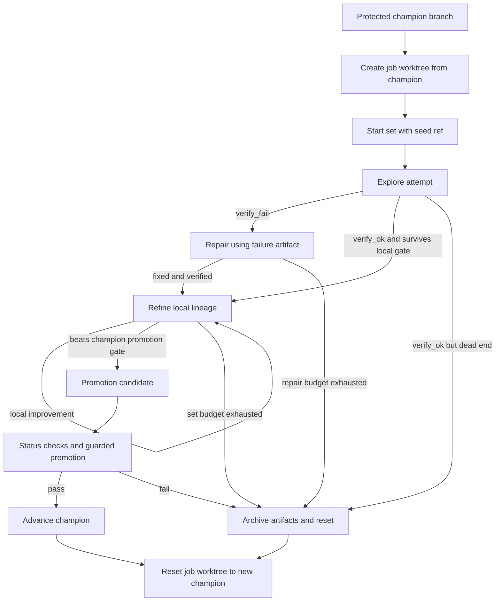
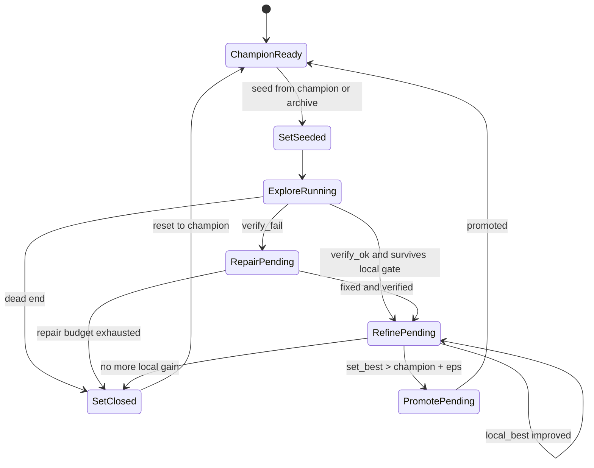
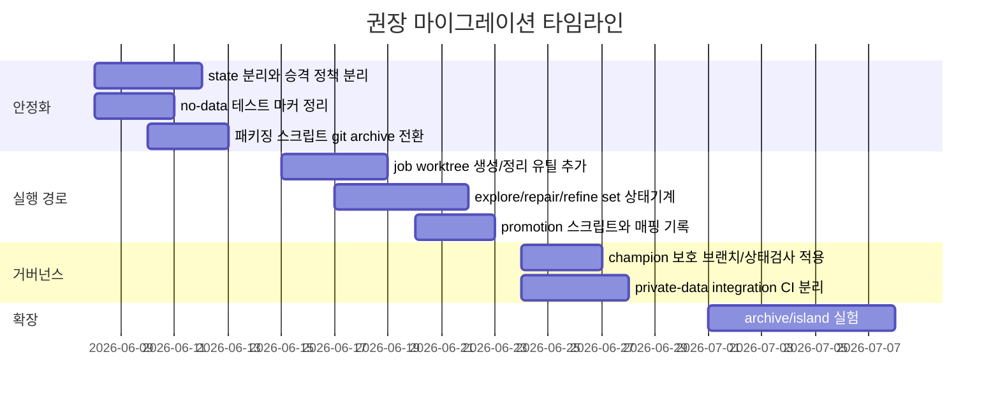

# Self-evolve harness 개선 방안 보고서

## Executive summary

첨부된 mechanics 문서는 현재 harness를 **단일 스칼라 `corpus_cer` 위의 greedy 1+1 hill-climbing**으로 설명하고, 매 iteration 종료 시 **on-disk `workspace/transcribe.py`가 마지막으로 commit된 champion과 같아야 한다**는 불변식을 핵심으로 둡니다. 같은 문서는 현재 구조의 긴장점으로 **explore도 champion 위에서 시작한다는 앵커링**, **`candidate.diff`의 base가 HEAD로 고정된다는 점**, 그리고 **더 나쁜 explore 결과가 reject되면 다시 champion으로 rollback되기 때문에 다음 refine이 그 explore 결과를 육성하지 못한다는 점**을 분명히 적고 있습니다. 즉, 지금의 문제는 단순한 스케줄러 조정 실패가 아니라, **같은 HEAD가 안정 기준, rollback 기준, 탐색 베이스를 동시에 겸하고 있는 구조적 충돌**입니다. fileciteturn0file0

따라서 권장안은 `explore/repair/refine`를 **하나의 세트(set)** 로 운용하되, 그 세트가 **global champion과 다른 Git 네임스페이스**에서 움직이도록 분리하는 것입니다. 가장 현실적인 형태는 **보호된 `champion` 브랜치**와 **job별 topic branch를 별도 `git worktree`에서 실행하는 이중 레인 구조**입니다. Git은 원래 **비선형 개발을 topic branch로 분리**할 것을 권장하고, 여러 branch를 동시에 checkout할 수 있는 **linked worktree**를 공식 기능으로 제공하며, 실험·테스트 용도로는 **throwaway worktree**도 권합니다. 또한 GitHub의 보호된 브랜치는 **상태 검사, 선형 이력, force push 금지, 삭제 금지** 같은 규칙을 강제할 수 있어 champion 안정성을 제도적으로 보장하기에 적합합니다. citeturn4view1turn5view4turn4view5turn4view6turn6view0

외부 연구 흐름도 같은 방향을 지지합니다. Self-Refine은 **생성 → 피드백 → 재수정**의 반복 루프를, Reflexion은 **실패 피드백을 episodic memory로 저장**하는 방식을 제안합니다. AlphaEvolve는 **프로그램 데이터베이스, evaluator pool, 다중 메트릭 최적화**를 사용하며, Darwin Gödel Machine은 **아카이브를 유지하면서 다양한 경로를 병렬 탐색**합니다. 즉, 최신 self-improvement 계열 시스템은 공통적으로 **안정된 기준선**과 **탐색 아카이브**, **평가 루프**, **피드백 메모리**를 분리합니다. 현재 harness도 같은 원칙을 적용해 **lineage 내부 전진 규칙**과 **global champion 승격 규칙**을 분리하는 것이 가장 합리적입니다. citeturn11view0turn11view1turn10view0turn12view2turn12view6turn12view7

이 보고서의 핵심 권고는 네 가지입니다. 첫째, **global champion과 job-local lineage를 다른 ref로 분리**합니다. 둘째, **explore/repair/refine을 단일 iteration이 아니라 bounded set로 운용**하되, set 내부 비교는 champion이 아니라 job-local set-best를 기준으로 합니다. 셋째, **promotion은 보호된 `champion` 브랜치에 대한 별도 단계**로 격리하고, PR 또는 자동 승격 스크립트 + 상태 검사로만 허용합니다. 넷째, **테스트와 패키징을 code-only / private-data / artifact로 분리**해 CI와 전달 산출물이 더럽혀지지 않게 만듭니다. citeturn6view0turn4view9turn4view10turn5view1turn5view2

## 문제 정의와 설계 원칙

현재 구조에서 가장 중요한 사실은, **기존 불변식 자체가 잘못된 것이 아니라 적용 범위가 너무 넓다**는 점입니다. mechanics 문서가 설명하듯 지금은 every iter가 champion 기준으로 닫히고, reject는 champion으로 돌아가며, 다음 시도 역시 champion 위에서 시작합니다. 이 불변식은 **global stability**를 지키는 데는 매우 강하지만, **global champion보다 당장은 나쁘지만 구조적으로 유망한 explore 결과를 몇 step 더 육성하는 일**과는 양립하기 어렵습니다. 같은 worktree 안에서 두 목표를 동시에 100% 만족시키려 하면, 결국 explore 결과는 살아남지 못합니다. fileciteturn0file0

따라서 개선 목표는 “기존 불변식을 폐기”하는 것이 아니라, **불변식을 레벨별로 재정의**하는 것입니다. Git 쪽으로 보면 이것은 자연스러운 분리입니다. Git workflow 문서는 비사소한 작업은 **topic branch**로 분리하라고 권하고, 여러 topic의 상호작용을 시험할 때는 **stable branch가 아닌 throw-away integration branch**에 먼저 합쳐 보라고 안내합니다. 이 원칙을 harness에 적용하면, champion은 stable branch, explore/repair/refine set는 job-local topic branch, 다중 parent combine은 선택적으로 throw-away integration branch에 해당합니다. citeturn4view1turn5view4

권장하는 설계 목표는 다음 다섯 가지 불변식으로 정리할 수 있습니다.

| 불변식 | 의미 | 왜 필요한가 |
|---|---|---|
| global champion 불변식 | `champion` worktree에서 on-disk `transcribe.py == champion HEAD` | 운영 기준선과 rollback 기준을 단일화하기 위해 |
| job lineage 불변식 | `job/<job_id>` worktree에서 on-disk `transcribe.py == active lineage HEAD` | set 내부 refine/repair가 local lineage를 이어받게 하기 위해 |
| promotion 불변식 | champion 이동은 `verify_ok + guard 통과 + 상태 검사 통과` 후에만 허용 | global best의 재현성과 안전성 확보 |
| resume 불변식 | 재시작 시 다음 action은 committed state와 artifacts만으로 결정 가능 | 중단/재개 재현성 확보 |
| artifact 불변식 | scored attempt와 failure artifact는 append-only로 보존 | repair와 사후 분석 가능성 확보 |

이 중 **global champion 불변식**은 지금 구조의 장점을 그대로 계승합니다. 바뀌는 것은 **job lineage 불변식**이 별도로 도입된다는 점입니다. Git의 linked worktree는 같은 저장소에서 **branch별로 서로 다른 working tree를 동시에 유지**할 수 있으므로, 이 분리는 파일시스템 레벨에서도 자연스럽습니다. 또한 공식 문서가 말하듯 worktree는 실험을 **기존 개발을 방해하지 않는 방식으로** 수행하기에 적합합니다. citeturn4view5turn4view6

설계 원칙은 LLM self-improvement 연구와도 정합적입니다. Self-Refine은 한 번의 출력으로 끝내지 않고 **반복 피드백 루프**를 사용하며, Reflexion은 이전 실패를 **다음 trial의 명시적 메모리**로 사용합니다. AlphaEvolve는 **evaluator pool과 program database**를 분리하고, Darwin Gödel Machine은 **archive를 기반으로 다양한 경로를 병렬로 확장**합니다. 즉, set 내부의 local lineage와 global champion을 분리하는 것은 단지 Git 편의가 아니라, self-evolve 계열 시스템의 일반 원리와도 맞습니다. citeturn11view0turn11view1turn10view0turn12view2turn12view6

## 설계 옵션 비교

현재 코드와 요구사항, 그리고 Git/agent literature를 함께 놓고 보면, 실제 선택지는 네 가지입니다. 아래 표는 **rollback 보장**, **구현 난이도**, **Git 변경 최소화**, **재현성**을 기준으로 비교한 것입니다.

| 옵션 | 핵심 아이디어 | 장점 | 단점 | 구현 난이도 | 운영 위험 | 권장 우선순위 |
|---|---|---|---|---|---|---|
| 상태만 분리 | 동일 branch·동일 worktree를 유지하되 `global_best`와 `job_best`만 state에서 분리 | Git 변화가 가장 적고 빠르게 적용 가능 | 같은 worktree에서 rollback 기준과 lineage 기준이 계속 충돌함. set 보호가 약함 | 낮음 | 중간 | 임시 완화책 |
| job branch + worktree 분리 | `champion`은 보호하고, `job/<job_id>`를 별도 worktree에서 실행 | 안전성, 재현성, repair/refine 세트 운영, resume가 가장 균형적 | promotion 스크립트/CI 규칙이 추가로 필요 | 중간 | 낮음 | **최우선 권장** |
| branchless snapshot 세트 | Git branch는 늘리지 않고 run artifact나 patch snapshot으로 local lineage 유지 | branch clutter가 적음 | resume와 rollback이 복잡하고, patch base drift가 생기기 쉬움 | 중간~높음 | 높음 | 비권장 |
| archive/islands 확장 | 여러 lineage를 장기 보존하고 family별 island 탐색 | 구조 발견 능력이 가장 큼 | 시스템 복잡도와 운영비 상승, 현재 목표엔 과투자 가능 | 높음 | 중간~높음 | 장기 과제 |

권장안은 두 번째 옵션입니다. 이유는 세 가지입니다. 첫째, Git 자체가 **topic branch + throw-away integration branch**라는 모델을 권장하고 있기 때문입니다. 둘째, worktree는 같은 저장소에서 **여러 branch를 동시에 checkout**할 수 있게 해 주므로 “global champion은 그대로 두고 job-local lineage만 움직인다”는 요구를 가장 직접적으로 만족시킵니다. 셋째, 보호된 브랜치는 **required status checks**와 **linear history**를 강제할 수 있어 champion 승격을 정책적으로 봉인할 수 있습니다. citeturn4view1turn5view4turn4view5turn6view0

장기적으로는 archive/islands 쪽이 더 강력할 수 있습니다. Darwin Gödel Machine의 아카이브 기반 open-ended exploration과 Live-SWE-agent의 런타임 자기진화는 그 가능성을 보여 줍니다. 하지만 그 계열은 **더 큰 scaffold와 safety machinery**를 요구합니다. 현재 사용자 요구가 “Git 변경 최소화, rollback 보장, 재현 가능한 파이프라인”에 더 가깝기 때문에, 먼저 **worktree 분리형 set 운영**으로 안정화한 뒤 나중에 archive/island를 얹는 것이 타당합니다. citeturn12view2turn12view7turn12view4turn12view5

브랜치 네이밍 규칙이 아직 정해지지 않았다면, 다음 둘 중 하나면 충분합니다. 보수형은 `champion/main`, `job/phase3_015`, `promote/phase3_015/set_003`이고, 단순형은 `champion`, `job/<job_id>`, `promote/<job_id>`입니다. branch clutter가 걱정되면 장기적으로 `refs/lineages/*`로 숨길 수 있지만, 초기에는 **가시성과 디버깅 편의**를 위해 보이는 branch 이름을 쓰는 편이 낫습니다. 이 역시 topic branch를 명시적으로 운용하라는 Git workflow 원칙과 맞습니다. citeturn4view1turn5view4

## 권장 아키텍처와 세트 동작

권장 구조는 **세 개의 레인**으로 이해하면 쉽습니다. 첫 번째는 **stable lane**으로, 보호된 `champion` 브랜치와 그 worktree입니다. 두 번째는 **job lane**으로, `job/<job_id>` branch를 별도 worktree에서 돌리며 explore/repair/refine 세트를 수행합니다. 세 번째는 **promotion lane**으로, job lane에서 뽑힌 승격 후보를 champion에 적용하는 통로입니다. 이 구조는 현재 harness가 이미 갖고 있는 **검증 파이프라인과 rollback discipline**은 보존하면서, explore 결과를 local lineage로 이어서 refine할 수 있게 만듭니다. fileciteturn0file0 citeturn4view5turn6view0turn10view0turn12view6



이 구조에서 중요한 것은 **비교 함수가 둘**이라는 점입니다. 하나는 `decide_lineage_progress`로, set 내부에서 explore/repair/refine 결과를 **job-local set-best 또는 lineage head**와 비교합니다. 다른 하나는 `decide_promotion`으로, set-best를 **global champion**과 비교해 승격 여부를 결정합니다. 현재 문제는 이 둘이 사실상 하나의 HEAD 비교로 합쳐져 있다는 데서 생겼습니다. AlphaEvolve와 DGM이 모두 **evaluator와 archive를 분리**하고, 이전 프로그램/에이전트를 데이터베이스에서 다시 샘플링하는 구조를 취하는 이유도 여기에 있습니다. 탐색 내부 전진과 전역 승격은 같지 않기 때문입니다. citeturn10view0turn12view2turn12view6

### 브랜치 전략과 rollback 정책

Git 정책은 다음이 가장 단순합니다. `champion`은 보호된 branch로 유지하고, 각 job는 `git worktree add <path> -b job/<job_id> champion` 형태로 시작합니다. job worktree 안에서 candidate는 오직 `workspace/transcribe.py`를 수정하고, 실패나 reject 시에는 **그 job worktree의 현재 lineage HEAD로만** 복원합니다. 반대로 `champion` worktree는 candidate가 절대로 건드리지 않습니다. 이런 분리는 현재 mechanics 문서가 강하게 요구하는 champion cleanliness를 살리면서도, local lineage 육성을 가능하게 합니다. fileciteturn0file0 citeturn4view5turn4view7

commit 정책은 **code checkpoint와 run metadata를 분리**하는 쪽이 바람직합니다. 가장 보수적인 이행 단계에서는 지금처럼 `runs/_summary`를 계속 기록하되, **code HEAD의 의미를 항상 “현재 lineage code”로 유지**해야 합니다. 최종적으로는 `state.json`, `candidate_meta.jsonl`, `decisions.jsonl`은 atomic file write로 durably 저장하고, Git commit은 **verified code checkpoint**와 **promotion commit**에만 쓰는 것이 더 깔끔합니다. 그렇지 않으면 job branch의 HEAD가 metadata-only commit 때문에 지나치게 자주 움직이면서 rollback의 의미가 다시 흐려질 수 있습니다. 이 설계는 복구 가능성과 history 명료성을 동시에 높입니다. citeturn4view7turn6view0turn12view6

promotion은 전체 job branch를 merge하지 말고, **승격 대상 verified commit 하나만 champion에 반영**하는 방식이 좋습니다. GitHub의 보호된 브랜치는 상태 검사를 필수로 만들 수 있고, **선형 이력(linear history)**도 강제할 수 있습니다. 문서가 말하듯 선형 이력은 변경을 **더 쉽게 되돌릴 수 있게** 해 줍니다. 따라서 `champion`에는 squash/rebase/cherry-pick 기반의 승격만 허용하고, topic branch의 전체 잡음 히스토리는 가져오지 않는 편이 낫습니다. citeturn6view0

### explore, repair, refine 세트의 상세 시나리오

세트는 보통 다음 순서로 작동합니다. 먼저 scheduler가 seed를 고릅니다. seed는 기본적으로 `champion`이지만, 나중에는 family archive나 near-best bank에서 가져올 수 있습니다. 그 다음 `explore`가 구조적 변화를 시도합니다. 이 시도는 **global champion보다 나쁘더라도** 당장 죽이지 않고, 먼저 **verify 통과 여부**와 **local survival gate**를 봅니다. survival gate는 초기에 단순하게 “catastrophic는 아니고, local 기준으로 refine할 가치가 있다” 정도면 충분합니다. 첫 단계에서는 너무 많은 정책 변경을 피하기 위해, current near-best 개념을 재사용하거나 약간 느슨하게 만드는 정도가 적절합니다. fileciteturn0file0 citeturn10view0turn11view0turn11view1

`repair`는 verify 실패 전용입니다. 현재 harness가 갖고 있는 failure artifact와 stderr 전달 방식은 이미 이 방향에 가깝습니다. 이 모드는 “새 아이디어를 다시 내라”가 아니라, **직전 실패 diff와 오류 신호를 직접 받아 그 실패를 고쳐라**는 형태여야 합니다. Reflexion이 보여 준 핵심은 실패 신호를 **episodic memory**로 남겨 다음 trial을 바꾸는 것이고, SWE-agent가 보여 준 핵심은 repository navigation, file editing, test execution 같은 **interface 설계 자체가 성능에 영향을 준다**는 점입니다. 따라서 repair는 현재처럼 candidate prompt에 실패 diff와 stderr를 주입하되, 그 base는 champion이 아니라 **현재 set의 lineage head**여야 합니다. citeturn11view1turn12view0turn12view1

`refine`는 verified local lineage를 몇 step 더 밀어 보는 단계입니다. 이때 비교 기준은 champion이 아니라 **set-best**입니다. 예를 들어 explore가 0.190에서 시작했고 champion이 0.154라 해도, set 내부에서 0.190 → 0.176 → 0.161로 내려오는 경우가 있을 수 있습니다. 지금 구조는 첫 0.190에서 죽지만, set 구조는 이를 2~3회 더 육성할 수 있습니다. 이 방식은 Self-Refine의 iterative refinement와 맞닿아 있고, DGM의 “여러 경로를 병렬로 확장하는 아카이브”와도 철학적으로 일치합니다. 다만 초기 도입에서는 set 길이를 짧게, 예컨대 **explore 1회 + repair/refine 최대 2~3회** 정도로 제한해 안전성과 비용을 통제하는 편이 좋습니다. citeturn11view0turn12view2turn12view6

세트 종료 조건은 단순해야 합니다. `set_best`가 global champion을 이기면 **promotion candidate**가 되고, 그렇지 않아도 family/axis 측면에서 유의미하면 **archive**로 남깁니다. 아무 가치가 없으면 discard하고 job worktree를 champion으로 재시드합니다. 여기서 핵심은 “promotion 실패”와 “set 실패”를 구분하는 것입니다. `set_best`가 champion보다 못했다는 이유만으로 그 lineage 전체를 무의미하게 취급하지 말아야 합니다. AlphaEvolve가 여러 이전 프로그램과 아이디어를 prompt sampler에서 다시 참고하고, DGM이 개선된 agent archive를 유지하는 이유도 바로 이런 **중간 산출물의 재사용성** 때문입니다. citeturn10view0turn12view2turn12view3



## 테스트 시뮬레이션과 CI 패키징

추천 구현은 상태 기계가 분명하기 때문에, 실제 private audio data가 없어도 **상당 부분을 시뮬레이션**할 수 있습니다. 특히 current harness mechanics 문서가 scheduler와 progress를 결정적 흐름으로 설명하고 있기 때문에, set 상태 전이도 충분히 **결정적 단위 테스트**로 묶을 수 있습니다. 여기에 Self-Refine/Reflexion 계열의 핵심인 “피드백을 다음 step에 연결하는지”를 검증하는 테스트를 더하면, 실제 STT 성능 이전에 파이프라인 정합성을 먼저 확보할 수 있습니다. fileciteturn0file0 citeturn11view0turn11view1

다음과 같은 시뮬레이터를 먼저 만드는 것이 좋습니다.

```python
def step_set(champion_ref, set_state, outcome):
    """
    outcome: {"verify": "ok|fail", "cer": float | None, "axis_win": bool, "fatal": bool}
    """
    if set_state.phase == "explore":
        if outcome["verify"] == "fail":
            return set_state.to_repair(last_failure=outcome)
        if survives_local_gate(outcome, champion_ref, set_state):
            return set_state.advance_lineage(outcome).to_refine()
        return set_state.close(reason="dead_end")

    if set_state.phase == "repair":
        if outcome["verify"] == "fail" and set_state.repairs_used >= set_state.max_repairs:
            return set_state.close(reason="repair_exhausted")
        if outcome["verify"] == "ok":
            return set_state.advance_lineage(outcome).to_refine()
        return set_state.to_repair(last_failure=outcome)

    if set_state.phase == "refine":
        if outcome["verify"] == "ok" and improves_local_best(outcome, set_state):
            new_state = set_state.advance_lineage(outcome)
            if beats_champion(outcome, champion_ref):
                return new_state.to_promotion()
            return new_state.to_refine()
        if set_state.refines_used >= set_state.max_refines:
            return set_state.close(reason="set_budget_exhausted")
        return set_state.to_refine()

    raise AssertionError("unknown phase")
```

이 시뮬레이터를 기준으로 권장 단위 테스트 케이스를 잡으면 다음과 같습니다. 아래 목록은 **private data 없이도 돌 수 있는 구조 테스트** 위주입니다.

| 테스트 케이스 | 목적 | 기대 결과 |
|---|---|---|
| champion 불변성 | reject/verify_fail 시 champion ref가 절대 움직이지 않는지 확인 | champion SHA 유지 |
| job lineage 전진 | local keep일 때만 lineage head가 전진하는지 확인 | job head만 이동 |
| refine base 검증 | refine가 global champion이 아니라 set lineage head를 기준으로 실행되는지 확인 | parent ref = lineage head |
| repair memory 검증 | repair가 마지막 failure artifact를 실제로 참조하는지 확인 | stderr/diff 전달 확인 |
| resume 재현성 | 중간 종료 후 재개 시 phase, set_best, lineage_ref가 복원되는지 확인 | 동일 next action |
| promotion 가드 | verify ok + required checks 없이는 champion 갱신 불가 | 승격 거부 |
| promotion 기록 | source job commit ↔ champion commit 매핑이 남는지 확인 | promotion_map 갱신 |
| worktree 청결성 | dirty worktree 삭제/정리 실패를 올바로 감지하는지 확인 | fail-fast |
| 패키징 누락 방지 | `.git`, caches, runs artifact가 source tar에 안 들어가는지 확인 | archive clean |
| marker 분리 | private data 없을 때 `requires_data` 테스트가 skip되는지 확인 | no-data CI green |
| 상태 기계 결정성 | 같은 trace면 같은 최종 상태가 나오는지 확인 | deterministic |
| cooldown 정규화 | `api:`/`rmapi:` prefix가 normalize되는지 확인 | surface cooldown 정상 작동 |

CI는 최소 두 층으로 분리해야 합니다. 첫 번째는 **no-data required checks**이고, 두 번째는 **private-data integration checks**입니다. pytest 문서는 `skipif`를 모듈 전체에도 적용할 수 있고, custom marker는 `pytest` 설정에 등록해 선택 실행할 수 있다고 설명합니다. 따라서 `requires_data`, `integration`, `worktree`, `promotion` 같은 marker를 등록하고, 공개 또는 일반 CI에서는 `-m "not requires_data"`만 필수로 돌리는 구성이 맞습니다. citeturn4view9turn4view10

branch protection은 `champion`에만 우선 도입하면 됩니다. GitHub 문서는 보호된 브랜치에 대해 **필수 상태 검사**, **필수 PR review**, **선형 이력**, **force push 금지**, **삭제 금지**를 설정할 수 있다고 설명합니다. 또한 상태 검사는 strict/loose 모드가 있어, 기본 분기의 최신 상태로 branch를 업데이트한 뒤 확인할지 여부를 선택할 수 있습니다. promotion 빈도가 낮고 champion 안정성이 최우선이면 **strict checks**가 맞고, 빌드 비용이 과도하면 초기에 loose로 시작한 뒤 post-merge revalidation을 덧붙일 수 있습니다. citeturn6view0

패키징은 현재처럼 수동 tar로 `.git`과 tracked summary를 함께 보내는 방식보다, **`git archive` 기반 source package**로 바꾸는 것이 좋습니다. Git 공식 문서는 `git archive`가 **named tree에서 archive를 생성**하고, `.gitattributes`의 `export-ignore`와 `--worktree-attributes`를 통해 archive에서 제외할 파일/디렉터리를 제어할 수 있다고 설명합니다. 즉, source-only tarball은 `git archive`로 만들고, `runs/`나 실험 요약은 별도의 artifact tarball로 분리하는 편이 가장 재현 가능하고 덜 더럽습니다. citeturn4view8turn5view0turn5view1turn5view2

## 마이그레이션 실행 계획과 산출물

마이그레이션은 **작게, 되돌릴 수 있게, champion을 건드리지 않는 순서**로 진행해야 합니다. 첫 번째 단계는 **상태 분리**입니다. 즉 `global champion`과 `job-local lineage`를 구분하는 state 필드를 추가하고, promotion과 lineage keep을 분리합니다. 두 번째 단계는 **worktree 기반 실행 경로**를 넣는 것입니다. 세 번째 단계는 **CI/보호 브랜치/패키징**을 정리하는 것입니다. 그 뒤에야 archive/island나 combine 개선 같은 확장에 손대는 것이 좋습니다. 이 순서는 Git의 topic branch/throw-away integration 원칙과, AlphaEvolve·DGM이 보여 준 “stable archive와 exploratory pool의 분리” 원칙을 함께 따른 것입니다. citeturn4view1turn5view4turn10view0turn12view2



### 필수 코드 변경 포인트

아래는 첨부 tar.gz 직접 inspection을 바탕으로 정리한 **파일/함수 레벨 변경 포인트**입니다. 모듈 경계는 mechanics 문서가 가리키는 현재 핵심 모듈과 일치합니다. fileciteturn0file0

| 파일 | 함수 또는 구조 | 권장 변경 |
|---|---|---|
| `harness/runner.py` | `RunnerConfig` | `champion_ref`, `job_ref`, `job_worktree`, `set_max_steps`, `max_repairs`, `max_refines` 추가 |
| `harness/runner.py` | `ensure_worktree_ready` | champion worktree와 job worktree의 허용 dirty 규칙을 분리 |
| `harness/runner.py` | `rollback_paths` | rollback target을 “champion”이 아니라 “현재 active lineage HEAD”로 일반화 |
| `harness/runner.py` | `_decide_iteration` | mode 결정뿐 아니라 `set_phase`와 `set_seed_ref`를 상태 기반으로 계산 |
| `harness/runner.py` | `run_iteration` | `decide_lineage_progress`와 `decide_promotion`의 이중 판정 경로 추가 |
| `harness/runner.py` | `commit_iteration` | code checkpoint commit과 metadata persistence를 분리하거나, 최소한 promotion commit 경로를 별도화 |
| `harness/state.py` | `HarnessState` | `champion_ref`, `lineage_ref`, `set_id`, `set_phase`, `set_best_hyp_id`, `set_best_cer`, `last_failure_artifact` 추가 |
| `harness/scheduler.py` | `SchedulerContext`, `decide_mode` | global progress 말고 set 내부 phase 전이를 표현할 상태 값 추가 |
| `harness/portfolio.py` | `Portfolio` | `global_best`와 별도로 `job_best` 또는 `active_lineage_best` 분리 |
| `harness/policy.py` | `decide_candidate` | `decide_lineage_progress`, `decide_promotion` 두 함수로 분리 |
| `harness/cooldown.py` | `compute_cooldowns` | `api:`/`rmapi:` normalize 수정 및 set-local dead-end 집계 보강 |
| `scripts/evolve.py` | CLI | `--champion-ref`, `--job-ref`, `--worktree-root`, `--set-budget` 등 추가 |
| `scripts/verify.sh` | runtime multiplier | default를 config와 맞추고 manual/CI 경로 문서화 |
| `tests/` | 테스트 구조 | `requires_data`/`integration` marker 분리, worktree/promotion state-machine 테스트 추가 |
| 신규 모듈 권장 | `harness/gitops.py` | `prepare_job_worktree`, `restore_lineage_head`, `promote_to_champion`, `cleanup_worktree` 분리 |

### migration script 예시

아래 예시는 구조를 바꾸는 최소 스크립트 예시입니다. CI나 원격 정책이 불명이라도, 로컬에서 동일한 레이아웃을 먼저 검증할 수 있습니다.

```bash
#!/usr/bin/env bash
set -euo pipefail

CHAMPION_REF="${CHAMPION_REF:-champion}"
JOB_ID="${JOB_ID:?need JOB_ID}"
JOB_REF="job/${JOB_ID}"
WT_ROOT="${WT_ROOT:-../wt-${JOB_ID}}"

# 1) champion ref가 없으면 현재 검증된 기준점에서 생성
if ! git show-ref --verify --quiet "refs/heads/${CHAMPION_REF}"; then
  git branch "${CHAMPION_REF}" HEAD
fi

# 2) job worktree 생성
if [ ! -d "${WT_ROOT}" ]; then
  git worktree add "${WT_ROOT}" -b "${JOB_REF}" "${CHAMPION_REF}"
fi

# 3) job 실행
(
  cd "${WT_ROOT}"
  python scripts/evolve.py \
    --job-id "${JOB_ID}" \
    --iters 25 \
    --candidate-cmd "claude -p" \
    --commit-results \
    --champion-ref "${CHAMPION_REF}" \
    --job-ref "${JOB_REF}" \
    --set-budget 4
)
```

promotion 경로는 별도 스크립트로 분리하는 편이 좋습니다. champion은 선형 이력을 유지해야 하므로, 전체 job branch를 merge하기보다 **선정된 verified commit 하나만 승격**하는 것이 안전합니다. GitHub 보호 브랜치를 쓰면 이 스크립트는 PR 생성만 담당하고, 실제 merge는 상태 검사 통과 후 발생하도록 할 수 있습니다. citeturn6view0

```bash
#!/usr/bin/env bash
set -euo pipefail

CHAMPION_REF="${CHAMPION_REF:-champion}"
SOURCE_COMMIT="${SOURCE_COMMIT:?need SOURCE_COMMIT}"

git switch "${CHAMPION_REF}"
git cherry-pick -x "${SOURCE_COMMIT}"

# no-data required checks
pytest -m "not requires_data"

# 여기서 CI/PR 경로로 넘기거나, 로컬 정책이면 push
git push origin "${CHAMPION_REF}"
```

### 패키징과 테스트 체크리스트 예시

source package는 다음처럼 바꾸는 것이 좋습니다. Git 공식 문서가 설명하듯 `export-ignore`와 `--worktree-attributes`를 함께 쓰면 archive 내용을 안정적으로 조정할 수 있습니다. citeturn5view0turn5view2

```gitattributes
runs/ export-ignore
.venv/ export-ignore
.pytest_cache/ export-ignore
.ruff_cache/ export-ignore
docs/reviews/ export-ignore
```

```bash
git archive \
  --format=tar.gz \
  --worktree-attributes \
  -o "dist/aig-source-$(git rev-parse --short champion).tar.gz" \
  champion
```

최종적으로 기대되는 운영 산출물은 다음 정도면 충분합니다.

- `docs/checklists/champion-promotion-checklist.md`
- `scripts/migrate_worktree_layout.sh`
- `scripts/promote_champion.sh`
- `scripts/package_source.sh`
- `tests/test_lineage_state_machine.py`
- `tests/test_promotion_policy.py`
- `tests/test_worktree_recovery.py`
- `tests/test_requires_data_markers.py`
- `runs/_summary/promotion_map.jsonl`
- `runs/_summary/<job_id>_set_state.json`

운영 체크리스트는 아래와 같이 매우 실무적으로 유지하는 편이 좋습니다.

- [ ] `champion` 브랜치에 force push와 삭제 금지 설정이 적용되었는가  
- [ ] `champion` 브랜치에 required status checks가 연결되었는가  
- [ ] `champion` 브랜치가 linear history를 요구하는가  
- [ ] no-data pytest job이 기본 CI에서 green인가  
- [ ] private-data integration job이 별도 runner에서 분리되어 있는가  
- [ ] job worktree 중단 후 재개 테스트가 통과하는가  
- [ ] promotion 시 source commit ↔ champion commit 매핑이 기록되는가  
- [ ] source tarball에 `.git`과 `runs/`가 섞이지 않는가  
- [ ] reject/verify_fail 후 champion ref가 절대 움직이지 않는가  
- [ ] refine가 lineage head를 기준으로 계속 이어지는가  

종합하면, 가장 중요한 변화는 **explore를 더 “세게” 만드는 것**이 아니라, **explore가 살아서 repair/refine로 넘어갈 수 있는 Git 네임스페이스를 따로 주는 것**입니다. 현재 mechanics 문서가 정의한 champion-clean invariant는 버릴 것이 아니라 **`champion` 레인에 한정해 더 강하게 유지**하고, set 내부에서는 **job-local lineage invariant**를 새로 두어 역할을 분리해야 합니다. 이 분리만 제대로 되면, 지금의 self-evolve harness는 “더 나쁜 job-local lineage가 global best를 오염시키는 구조”에서 벗어나, **안정적이고 재현 가능한 진화 파이프라인**으로 자연스럽게 발전할 수 있습니다. fileciteturn0file0 citeturn4view5turn6view0turn10view0turn12view2