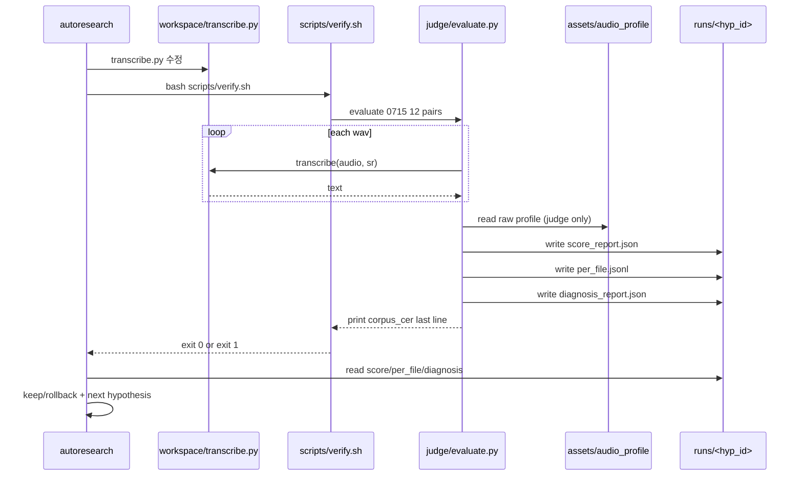
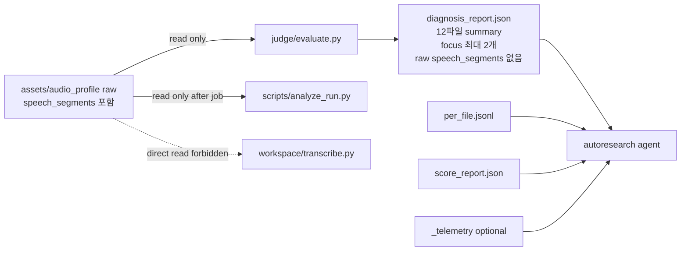

# Phase 3 Loop — Agent Architecture

> **목적**: Phase 3 에서 autoresearch 루프가 어떤 입력을 보고, 무엇을 수정하고,
> 어떤 기준으로 keep/rollback 되는지 한눈에 보기 위한 보조 문서.
> 운영 정본은 `PHASE3-PLAN.md` 이며, 이 문서는 구조 이해용이다.

---

## 1. 전체 루프

```mermaid
flowchart TD
    A[Phase 3 진입] --> B[seal_holdout.sh<br/>0813 chmod 000]
    B --> C[verify 가드 활성화<br/>backend/profile 직접참조 차단]
    C --> D[/autoresearch 시작]

    D --> E[Agent가 workspace/transcribe.py 수정]
    E --> F[Verify: bash scripts/verify.sh]
    F --> G[judge.evaluate<br/>0715 12 files]

    G --> H[score_report.json<br/>CER/time/guards]
    G --> I[per_file.jsonl<br/>per-file metrics]
    G --> J[diagnosis_report.json<br/>12파일 summary + focus 최대 2개]
    G --> K[_telemetry/*.jsonl/.srt<br/>optional]

    H --> L{Hard fail?}
    L -->|yes| M[ROLLBACK<br/>commit discard]
    L -->|no| N{Meaningful improvement?<br/>CER <= best - 2σ}
    N -->|yes| O[KEEP<br/>best 갱신]
    N -->|no| M

    O --> P{Final target reached?<br/>CER <= baseline target<br/>time within budget}
    P -->|no| E
    M --> Q{iter 남음?}
    Q -->|yes| E
    Q -->|no| R[Phase 2 분석]
    P -->|yes| R

    R --> S[analyze_run.py<br/>전체 evolution 평가]
    S --> T[evaluate_holdout.py --unseal<br/>0813 1회 평가]
```

---

## 2. Iteration 내부 시퀀스



---

## 3. 노출 모델



`speech_segments` 원본 start/end 리스트는 `diagnosis_report.json` 에 넣지 않는다.
구체 경계는 그대로 chunking recipe 가 될 수 있으므로, 에이전트에는 segment 개수,
발화 길이 분위수, 무음 gap 분위수 같은 summary 만 제공한다.

---

## 4. 판단 기준

| 층위 | 기준 | 역할 |
|------|------|------|
| Hard fail | backend/profile 직접참조, holdout 접근, 산술 불일치, evaluate 실패 | 무효 후보 즉시 rollback |
| Final CER target | `corpus_cer <= baseline/target_cer.json:target_cer` | 최종 목표: faster-whisper CER 이하 달성 |
| Final time target | `total_inference_time_s <= baseline.total_inference_time_s * budget` | 최종 목표: faster-whisper time budget 안에 들기 |
| Noise floor | `Δcer >= 2σ` | 노이즈가 아닌 개선만 keep |
| Quality diagnostics | hallucination/repetition/length/coverage | 기본은 진단, 최종 목표 baseline 대비 큰 악화만 fail |

Phase 3 의 중간 루프는 현재 best 를 조금씩 갱신하는 과정이고, faster-whisper baseline 은
매 iter 기준점이 아니라 **최종 목표점**이다. 최종적으로는 faster-whisper 보다 낮은 CER을
time budget 안에서 달성하면서 품질 가드를 악화시키지 않는 것이 목표다.
