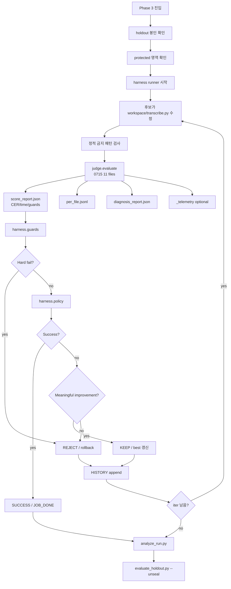
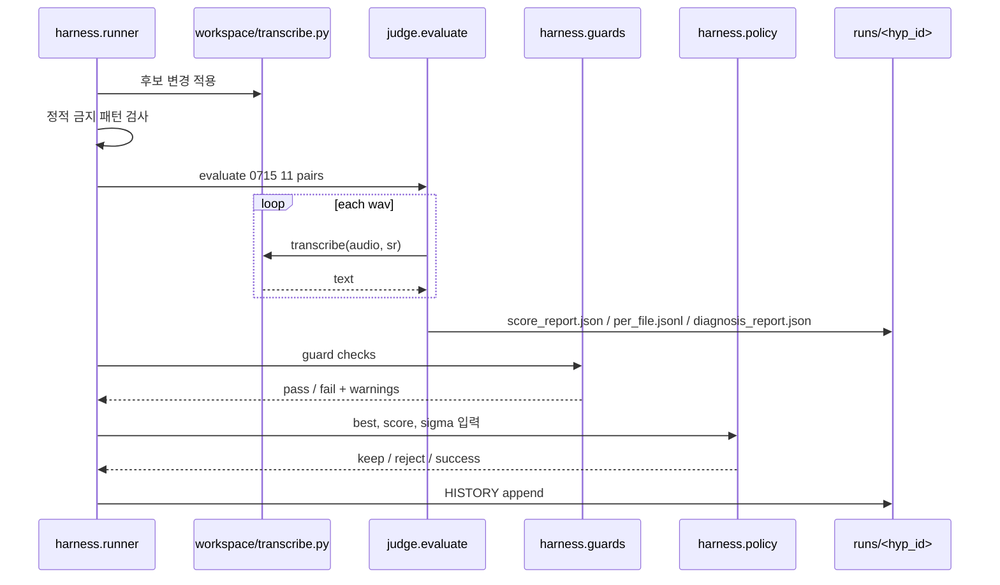
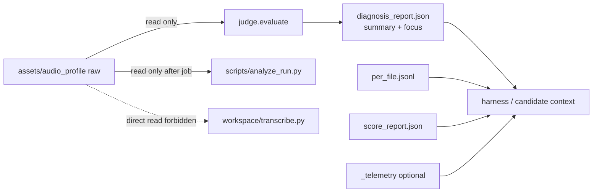

# Phase 3 Loop — Harness Architecture

> 목적: 자체 `harness/` loop의 입력, 산출물, keep/reject 흐름을 한눈에 보기 위한
> 보조 문서. 운영 정본은 [`PHASE3-PLAN.md`](PHASE3-PLAN.md)이다.

---

## 1. 전체 루프

---

## 2. Iteration 내부 시퀀스

---

## 3. 노출 모델

`speech_segments` 원본 start/end 리스트는 `diagnosis_report.json`에 넣지 않는다.
후보는 raw audio profile이 아니라 diagnosis summary와 자기 telemetry만 사용한다.

---

## 4. 판단 기준

| 층위 | 기준 | 역할 |
|------|------|------|
| Hard fail | backend/profile 직접참조, holdout 접근, 산술 불일치, evaluate 실패 | 무효 후보 reject |
| Final target | `corpus_cer <= target_cer` + baseline time budget | 성공 |
| Noise floor | `Δcer >= 2σ` 또는 provisional fallback | keep |
| Quality diagnostics | hallucination/repetition/length/coverage | warning 또는 hard fail |
